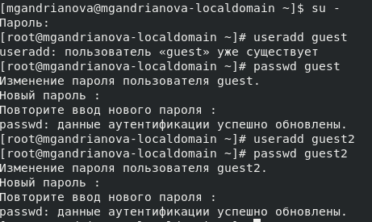
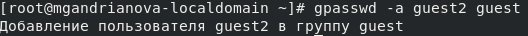
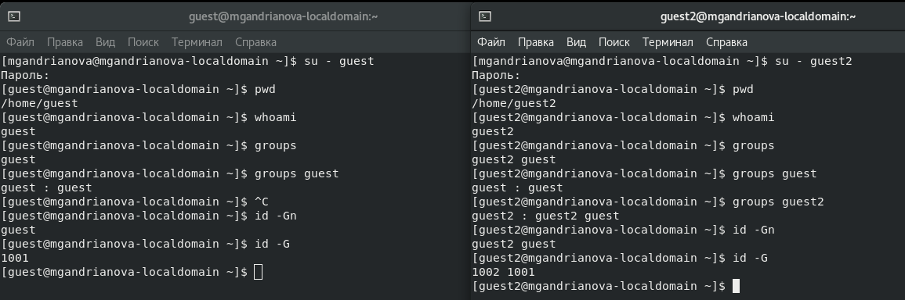
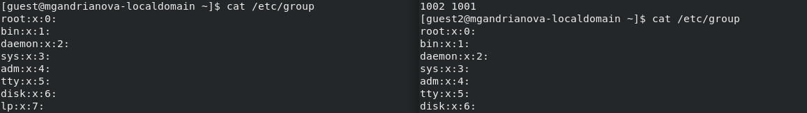
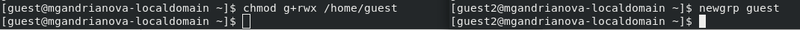
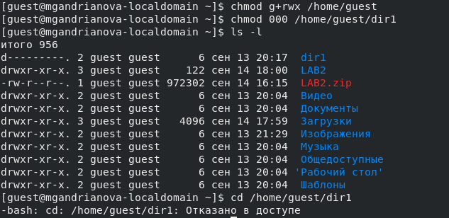

---
## Front matter
lang: ru-RU
title: 3-ая лабораторная работа
author: |
	Andrianova Marina Georgievna
institute: |
	\RUDN University, Moscow, Russian Federation
date: 2024, 18 September, Moscow

## Formatting
toc: false
slide_level: 2
theme: metropolis
header-includes: 
 - \metroset{progressbar=frametitle,sectionpage=progressbar,numbering=fraction}
 - '\makeatletter'
 - '\beamer@ignorenonframefalse'
 - '\makeatother'
aspectratio: 43
section-titles: true
---

## Цель работы

Целью данной работы является получение практических навыков работы в консоли с атрибутами файлов для групп пользователей.

## Выполнение лабораторной работы

В установленной при выполнении лабораторной работы ОС создаём учётные записи пользователей guest и guest2; задала пароль для этих пользователей(рис.1).

{#fig:001 width=70%}

Добавляем пользователя guest2 в группу guest командой "gpasswd -a guest2 guest" (рис.2).

{#fig:002 width=70%}

Осуществляем вход в систему от двух пользователей на двух разных консолях. Определяем директорию, в которой я нахожусь. С помощью команд "groups guest" и "groups guest2" определяем, что пользователь guest входит в группу guest, а пользователь guest2 - в группы guest и guest2. Сравниваем полученную информацию с выводом команд "id -Gn" и "id -G" в консоли с пользователем guest и guest2. Данные совпали, кроме второй команды "id -G"(рис.3).

{#fig:003 width=70%}

Просматриваем файл /etc/group командой "cat /etc/group" (рис.4), данные этого файла совпадают с полученными ранее (рис.5).

{#fig:004 width=70%}

{#fig:005 width=70%}

От имени пользователя guest2 регистрируем этого пользователя в группе guest. Далее от имени пользователя guest меняем права директории /home/guest, разрешив все действия для пользователей группы (рис.6). От имени пользователя guest снимаем с директории /home/guest/dir1 все атрибуты и проверяем правильность снятия атрибутов командой(рис.7).

{#fig:006 width=70%}

{#fig:007 width=70%}

## Выводы

В ходе выполнения данной лабораторной работы я получила практические навыки работы в консоли с атрибутами файлов для групп пользователей.
