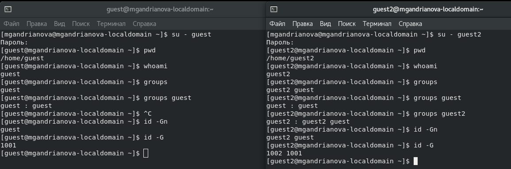

---
## Front matter
title: "Отчёт по лабораторной работе №3"
subtitle: "Дисциплина: Информационная безопасность"
author: "Андрианова Марина Георгиевна"

## Generic otions
lang: ru-RU
toc-title: "Содержание"

## Bibliography
bibliography: bib/cite.bib
csl: pandoc/csl/gost-r-7-0-5-2008-numeric.csl

## Pdf output format
toc: true # Table of contents
toc-depth: 2
lof: true # List of figures
lot: true # List of tables
fontsize: 12pt
linestretch: 1.5
papersize: a4
documentclass: scrreprt
## I18n polyglossia
polyglossia-lang:
  name: russian
  options:
	- spelling=modern
	- babelshorthands=true
polyglossia-otherlangs:
  name: english
## I18n babel
babel-lang: russian
babel-otherlangs: english
## Fonts
mainfont: IBM Plex Serif
romanfont: IBM Plex Serif
sansfont: IBM Plex Sans
monofont: IBM Plex Mono
mathfont: STIX Two Math
mainfontoptions: Ligatures=Common,Ligatures=TeX,Scale=0.94
romanfontoptions: Ligatures=Common,Ligatures=TeX,Scale=0.94
sansfontoptions: Ligatures=Common,Ligatures=TeX,Scale=MatchLowercase,Scale=0.94
monofontoptions: Scale=MatchLowercase,Scale=0.94,FakeStretch=0.9
mathfontoptions:
## Biblatex
biblatex: true
biblio-style: "gost-numeric"
biblatexoptions:
  - parentracker=true
  - backend=biber
  - hyperref=auto
  - language=auto
  - autolang=other*
  - citestyle=gost-numeric
## Pandoc-crossref LaTeX customization
figureTitle: "Рис."
tableTitle: "Таблица"
listingTitle: "Листинг"
lofTitle: "Список иллюстраций"
lotTitle: "Список таблиц"
lolTitle: "Листинги"
## Misc options
indent: true
header-includes:
  - \usepackage{indentfirst}
  - \usepackage{float} # keep figures where there are in the text
  - \floatplacement{figure}{H} # keep figures where there are in the text
---

# Цель работы

Получение практических навыков работы в консоли с атрибутами файлов для групп пользователей.

# Выполнение лабораторной работы

В установленной при выполнении лабораторной работы ОС создаём учётные записи пользователей guest и guest2 с помощью команд "useradd guest" и "useradd guest2", заранее введя команду "su -" (чтобы зайти в учётную запись администратора); задала пароль для этих пользователей командами "sudo passwd guest" и "sudo passwd guest2"(рис.1).

{#fig:001 width=70%}

Добавляем пользователя guest2 в группу guest командой "gpasswd -a guest2 guest" (рис.2).

{#fig:002 width=70%}

Осуществляем вход в систему от двух пользователей на двух разных консолях при помощи команд "su - guest" на первой консоли и su - guest2" на второй консоли. Для обоих пользователей командой "pwd" определяем директорию, в которой я нахожусь: это домашняя директория, что совпадает с приглашениями командной строки. Уточняем имя пользователей командой "whoami", получаем: guest и guest2. С помощью команд "groups guest" и "groups guest2" определяем, что пользователь guest входит в группу guest, а пользователь guest2 - в группы guest и guest2. Сравниваем полученную информацию с выводом команд "id -Gn" и "id -G" в консоли с пользователем guest и guest2. Данные совпали, кроме второй команды "id -G", которая вывела номера групп 1001 и 1002, что также является верным (рис.3).

{#fig:003 width=70%}

Просматриваем файл /etc/group командой "cat /etc/group" (рис.4), данные этого файла совпадают с полученными ранее (рис.5).

{#fig:004 width=70%}

{#fig:005 width=70%}

От имени пользователя guest2 регистрируем этого пользователя в группе guest командой "newgrp guest". Далее от имени пользователя guest меняем права директории /home/guest, разрешив все действия для пользователей группы командой "chmod g+rwx /home/guest" (рис.6). От имени пользователя guest снимаем с директории /home/guest/dir1 все атрибуты командой "chmod 000 dir1" и проверяем правильность снятия атрибутов командой "ls -l" (рис.7).

{#fig:006 width=70%}

{#fig:007 width=70%}

Меняя атрибуты у директории dir1 и файла file1 от имени пользователя guest и делая проверку от пользователя guest2, заполняем таблицу.

Если операция разрешена, занесём в таблицу знак «+», если не разрешена, знак «-».
Создание файла: "echo "text" > /home/guest/dir1/file2".
Удаление файла: "rm -r /home/guest/dir1/file1".
Запись в файл: "echo "textnew" > /home/guest/dir1/file1".
Чтение файла: "cat /home/guest/dir1/file1".
Смена директории: "cd /home/guest/dir1".
Просмотр файлов в директории: "ls /home/guest/dir1".
Переименование файла: "mv /home/guest/dir1/file1 filenew".
Смена атрибутов файла: "chattr -a /home/guest/dir1/file1".

| Права директории | Права файла | Создание файла | Удаление файла | Запись в файл | Чтение файла | Смена директории | Просмотр файлов в директории | Переименование файла | Смена атрибутов файла |
|------------------|-------------|----------------|----------------|---------------|--------------|------------------|------------------------------|----------------------|-----------------------|
| d (000)          | (000)       | -              | -              | -             | -            | -                | -                            | -                    | -                     |
| d –x (100)       | (000)       | -              | -              | -             | -            | +                | -                            | -                    | -                     |
| d -w- (200)      | (000)       | -              | -              | -             | -            | -                | -                            | -                    | -                     |
| d -wx (300)      | (000)       | +              | +              | -             | -            | +                | -                            | +                    | -                     |
| d r– (400)       | (000)       | -              | -              | -             | -            | -                | +                            | -                    | -                     |
| d r-x (500)      | (000)       | -              | -              | -             | -            | +                | +                            | -                    | -                     |
| d rw- (600)      | (000)       | -              | -              | -             | -            | -                | +                            | -                    | -                     |
| d rwx (700)      | (000)       | +              | +              | -             | -            | +                | +                            | +                    | -                     |
|------------------|-------------|----------------|----------------|---------------|--------------|------------------|------------------------------|----------------------|-----------------------|
| d (000)          | (100)       | -              | -              | -             | -            | -                | -                            | -                    | -                     |
| d –x (100)       | (100)       | -              | -              | -             | -            | +                | -                            | -                    | -                     |
| d -w- (200)      | (100)       | -              | -              | -             | -            | -                | -                            | -                    | -                     |
| d -wx (300)      | (100)       | +              | +              | -             | -            | +                | -                            | +                    | -                     |
| d r– (400)       | (100)       | -              | -              | -             | -            | -                | +                            | -                    | -                     |
| d r-x (500)      | (100)       | -              | -              | -             | -            | +                | +                            | -                    | -                     |
| d rw- (600)      | (100)       | -              | -              | -             | -            | -                | +                            | -                    | -                     |
| d rwx (700)      | (100)       | +              | +              | -             | -            | +                | +                            | +                    | -                     |
|------------------|-------------|----------------|----------------|---------------|--------------|------------------|------------------------------|----------------------|-----------------------|
| d (000)          | (200)       | -              | -              | -             | -            | -                | -                            | -                    | -                     |
| d –x (100)       | (200)       | -              | -              | +             | -            | +                | -                            | -                    | -                     |
| d -w- (200)      | (200)       | -              | -              | -             | -            | -                | -                            | -                    | -                     |
| d -wx (300)      | (200)       | +              | +              | +             | -            | +                | -                            | +                    | -                     |
| d r– (400)       | (200)       | -              | -              | -             | -            | -                | +                            | -                    | -                     |
| d r-x (500)      | (200)       | -              | -              | +             | -            | +                | +                            | -                    | -                     |
| d rw- (600)      | (200)       | -              | -              | -             | -            | -                | +                            | -                    | -                     |
| d rwx (700)      | (200)       | +              | +              | +             | -            | +                | +                            | +                    | -                     |
|------------------|-------------|----------------|----------------|---------------|--------------|------------------|------------------------------|----------------------|-----------------------|
| d (000)          | (300)       | -              | -              | -             | -            | -                | -                            | -                    | -                     |
| d –x (100)       | (300)       | -              | -              | +             | -            | +                | -                            | -                    | -                     |
| d -w- (200)      | (300)       | -              | -              | -             | -            | -                | -                            | -                    | -                     |
| d -wx (300)      | (300)       | +              | +              | +             | +            | +                | -                            | +                    | -                     |
| d r– (400)       | (300)       | -              | -              | -             | -            | -                | +                            | -                    | -                     |
| d r-x (500)      | (300)       | -              | -              | +             | -            | +                | +                            | -                    | -                     |
| d rw- (600)      | (300)       | -              | -              | -             | -            | -                | +                            | -                    | -                     |
| d rwx (700)      | (300)       | +              | +              | +             | +            | +                | +                            | +                    | -                     |
|------------------|-------------|----------------|----------------|---------------|--------------|------------------|------------------------------|----------------------|-----------------------|
| d (000)          | (400)       | -              | -              | -             | -            | -                | -                            | -                    | -                     |
| d –x (100)       | (400)       | -              | -              | -             | +            | +                | -                            | -                    | -                     |
| d -w- (200)      | (400)       | -              | -              | -             | -            | -                | -                            | -                    | -                     |
| d -wx (300)      | (400)       | +              | +              | -             | +            | +                | -                            | +                    | -                     |
| d r– (400)       | (400)       | -              | -              | -             | -            | -                | +                            | -                    | -                     |
| d r-x (500)      | (400)       | -              | -              | -             | +            | +                | +                            | -                    | -                     |
| d rw- (600)      | (400)       | -              | -              | -             | -            | -                | +                            | -                    | -                     |
| d rwx (700)      | (400)       | +              | +              | -             | +            | +                | +                            | +                    | -                     |
|------------------|-------------|----------------|----------------|---------------|--------------|------------------|------------------------------|----------------------|-----------------------|
| d (000)          | (500)       | -              | -              | -             | -            | -                | -                            | -                    | -                     |
| d –x (100)       | (500)       | -              | -              | -             | +            | +                | -                            | -                    | -                     |
| d -w- (200)      | (500)       | -              | -              | -             | -            | -                | -                            | -                    | -                     |
| d -wx (300)      | (500)       | +              | +              | -             | +            | +                | -                            | +                    | -                     |
| d r– (400)       | (500)       | -              | -              | -             | -            | -                | +                            | -                    | -                     |
| d r-x (500)      | (500)       | -              | -              | -             | +            | +                | +                            | -                    | -                     |
| d rw- (600)      | (500)       | -              | -              | -             | -            | -                | +                            | -                    | -                     |
| d rwx (700)      | (500)       | +              | +              | -             | +            | +                | +                            | +                    | -                     |
|------------------|-------------|----------------|----------------|---------------|--------------|------------------|------------------------------|----------------------|-----------------------|
| d (000)          | (600)       | -              | -              | -             | -            | -                | -                            | -                    | -                     |
| d –x (100)       | (600)       | -              | -              | +             | +            | +                | -                            | -                    | -                     |
| d -w- (200)      | (600)       | -              | -              | -             | -            | -                | -                            | -                    | -                     |
| d -wx (300)      | (600)       | +              | +              | +             | +            | +                | -                            | +                    | -                     |
| d r– (400)       | (600)       | -              | -              | -             | -            | -                | +                            | -                    | -                     |
| d r-x (500)      | (600)       | -              | -              | +             | +            | +                | +                            | -                    | -                     |
| d rw- (600)      | (600)       | -              | -              | -             | -            | -                | +                            | -                    | -                     |
| d rwx (700)      | (600)       | +              | +              | +             | +            | +                | +                            | +                    | -                     |
|------------------|-------------|----------------|----------------|---------------|--------------|------------------|------------------------------|----------------------|-----------------------|
| d (000)          | (700)       | -              | -              | -             | -            | -                | -                            | -                    | -                     |
| d –x (100)       | (700)       | -              | -              | +             | +            | +                | -                            | -                    | -                     |
| d -w- (200)      | (700)       | -              | -              | -             | -            | -                | -                            | -                    | -                     |
| d -wx (300)      | (700)       | +              | +              | +             | +            | +                | -                            | +                    | -                     |
| d r– (400)       | (700)       | -              | -              | -             | -            | -                | +                            | -                    | -                     |
| d r-x (500)      | (700)       | -              | -              | +             | +            | +                | +                            | -                    | -                     |
| d rw- (600)      | (700)       | -              | -              | -             | -            | -                | +                            | -                    | -                     |
| d rwx (700)      | (700)       | +              | +              | +             | +            | +                | +                            | +                    | -                     |
|------------------|-------------|----------------|----------------|---------------|--------------|------------------|------------------------------|----------------------|-----------------------|

Сравнивая полученную таблицу с таблицей из прошлой лабораторной работы, приходим к выводу, что изменился только последний столбец, позволяющий изменять атрибуты у файла: теперь это сделать невозможно, т.к. у владельца файла и директории нет на это прав (во всех случаях в первой позиции стоят 0). При определенном наборе прав остальные действия выполняются или не выполняются аналогично предыдущей таблице, но теперь как для владельца, так и для группы.

Заполним таблицу «Минимально необходимые права для выполнения операций внутри директории».

| Операция               | Минимальные права на директорию | Минимальные права на файл |
|------------------------|---------------------------------|---------------------------|
| Создание файла         | d -wx (300)                     | (000)                     |
| Удаление файла         | d -wx (300)                     | (000)                     |
| Чтение файла           | d –x (100)                      | (400)                     |
| Запись в файл          | d –x (100)                      | (200)                     |
| Переименование файла   | d -wx (300)                     | (000)                     |
| Создание поддиректории | d -wx (300)                     | (000)                     |
| Удаление поддиректории | d -wx (300)                     | (000)                     |

# Выводы

В ходе выполнения данной лабораторной работы я получила практические навыки работы в консоли с атрибутами файлов для групп пользователей.

# Список литературы

- Права доступа к файлам в Linux [Электронный ресурс]. 2019. URL: https://losst.ru/prava-dostupa-k-fajlam-v-linux.

