---
## Front matter
lang: ru-RU
title: 5-ая лабораторная работа
author: |
	Andrianova Marina Georgievna
institute: |
	\RUDN University, Moscow, Russian Federation
date: 2024, 04 October, Moscow

## Formatting
toc: false
slide_level: 2
theme: metropolis
header-includes: 
 - \metroset{progressbar=frametitle,sectionpage=progressbar,numbering=fraction}
 - '\makeatletter'
 - '\beamer@ignorenonframefalse'
 - '\makeatother'
aspectratio: 43
section-titles: true
---

## Цель работы

Целью данной работы является изучение механизмов изменения идентификаторов, применения SetUID- и Sticky-битов. Получение практических навыков работы в консоли с дополнительными атрибутами. Рассмотрение работы механизма смены идентификатора процессов пользователей, а также влияние бита Sticky на запись и удаление файлов.

## Выполнение лабораторной работы

Для лабораторной работы необходимо проверить, установлен ли компилятор gcc. Также осуществляется отключение системы запретом (рис. 1).

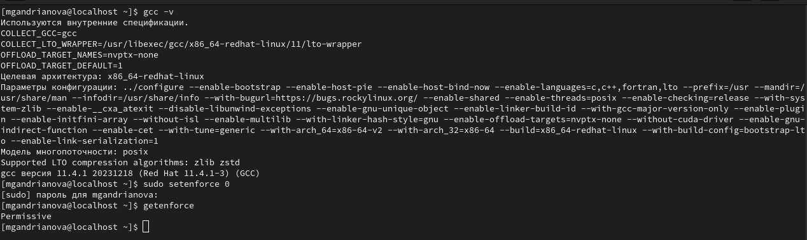{#fig:001 width=70%}

Осуществляется вход от имени пользователя guest (рис. 2).

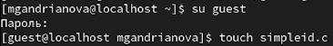{#fig:002 width=70%}

Создание файла simpleid.c (рис. 3)

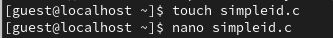{#fig:003 width=70%}

Cодержимое файла выглядит следующим образом (рис. 4)

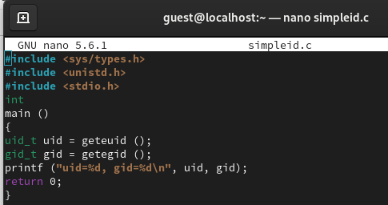{#fig:004 width=70%}

Компилирую файл, проверяю, что он скомпилировался (рис. 5)

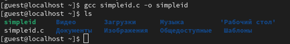{#fig:005 width=70%}

Запускаю исполняемый файл. В выводе файла выписаны номера пользователя и групп; от вывода при вводе if они отличаются только тем, что информации меньше (рис. 6)

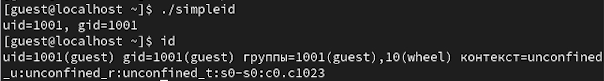{#fig:006 width=70%}

Создание файла simpleid2.c и запись в файл кода (рис. 7)

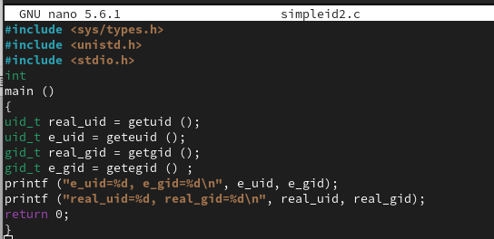{#fig:007 width=70%}

Компиляция файла simpleid2.c. Запуск программы (рис. 8)

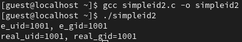{#fig:008 width=70%}

С помощью chown изменяю владельца файла на суперпользователя, с помощью chmod изменяю права доступа (рис. 9)

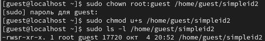{#fig:009 width=70%}

Создание файла readfile.c и запись кода в файл (рис. 10)

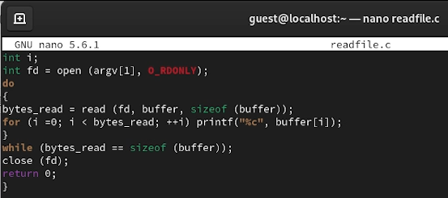{#fig:010 width=70%}
    
Компиляция файла readfile.c. Запуск программы (рис. 11)

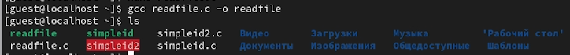{#fig:011 width=70%}

Снова от имени суперпользователи меняю владельца файла readfile. Далее меняю права доступа так, чтобы пользователь guest не смог прочесть содержимое файла (рис. 12)

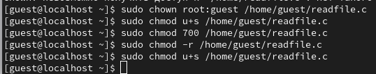{#fig:012 width=70%}

Проверка прочесть файл от имени пользователя guest. Прочесть файл не удается (рис. 13)

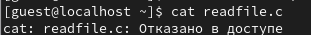{#fig:013 width=70%}

Пробуем прочесть файл от имени суперпользователя и чтение проходит успешно (рис. 14)

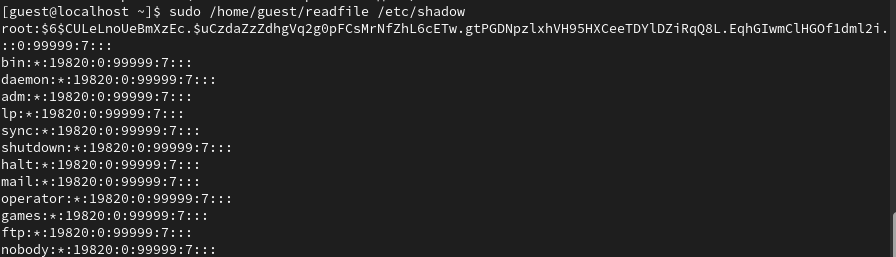{#fig:014 width=70%}

Проверяем папку tmp на наличие атрибута Sticky, т.к. в выводе есть буква t, то атрибут установлен (рис. 15)

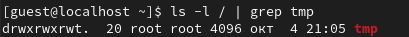{#fig:015 width=70%}

От имени пользователя guest создаю файл с текстом, добавляю права на чтение и запись для других пользователей (рис. 16)

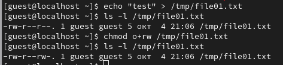{#fig:016 width=70%}

Далее пробуем удалить файл, получаем отказ (рис. 17)

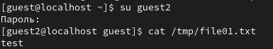{#fig:017 width=70%}

От имени суперпользователя снимаем с директории атрибут Sticky (рис. 18)

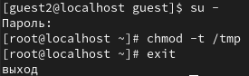{#fig:018 width=70%}

Далее был выполнен повтор предыдущих действий. По результатам без Sticky-бита удаление файла прошло успешно (рис. 19)

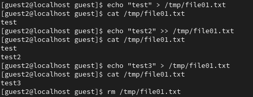{#fig:019 width=70%}

Возвращение директории tmp атрибута t от имени суперпользователя (рис. 20)

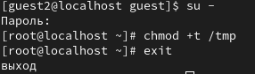{#fig:020 width=70%}

## Выводы

Изучила механизм изменения идентификаторов, применила SetUID- и Sticky-биты. Получила практические навыки работы в консоли с дополнительными атрибутами. Рассмотрела работы механизма смены идентификатора процессов пользователей, а также влияние бита Sticky на запись и удаление файлов.