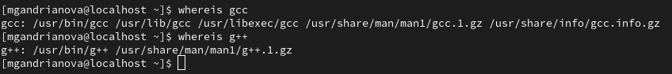

---
## Front matter
title: "Отчёт по лабораторной работе №5"
subtitle: "Дисциплина: Информационная безопасность"
author: "Андрианова Марина Георгиевна"

## Generic otions
lang: ru-RU
toc-title: "Содержание"

## Bibliography
bibliography: bib/cite.bib
csl: pandoc/csl/gost-r-7-0-5-2008-numeric.csl

## Pdf output format
toc: true # Table of contents
toc-depth: 2
lof: true # List of figures
lot: true # List of tables
fontsize: 12pt
linestretch: 1.5
papersize: a4
documentclass: scrreprt
## I18n polyglossia
polyglossia-lang:
  name: russian
  options:
	- spelling=modern
	- babelshorthands=true
polyglossia-otherlangs:
  name: english
## I18n babel
babel-lang: russian
babel-otherlangs: english
## Fonts
mainfont: IBM Plex Serif
romanfont: IBM Plex Serif
sansfont: IBM Plex Sans
monofont: IBM Plex Mono
mathfont: STIX Two Math
mainfontoptions: Ligatures=Common,Ligatures=TeX,Scale=0.94
romanfontoptions: Ligatures=Common,Ligatures=TeX,Scale=0.94
sansfontoptions: Ligatures=Common,Ligatures=TeX,Scale=MatchLowercase,Scale=0.94
monofontoptions: Scale=MatchLowercase,Scale=0.94,FakeStretch=0.9
mathfontoptions:
## Biblatex
biblatex: true
biblio-style: "gost-numeric"
biblatexoptions:
  - parentracker=true
  - backend=biber
  - hyperref=auto
  - language=auto
  - autolang=other*
  - citestyle=gost-numeric
## Pandoc-crossref LaTeX customization
figureTitle: "Рис."
tableTitle: "Таблица"
listingTitle: "Листинг"
lofTitle: "Список иллюстраций"
lotTitle: "Список таблиц"
lolTitle: "Листинги"
## Misc options
indent: true
header-includes:
  - \usepackage{indentfirst}
  - \usepackage{float} # keep figures where there are in the text
  - \floatplacement{figure}{H} # keep figures where there are in the text
---

# Цель работы

Изучение механизмов изменения идентификаторов, применения SetUID- и Sticky-битов. Получение практических навыков работы в консоли с дополнительными атрибутами. Рассмотрение работы механизма смены идентификатора процессов пользователей, а также влияние бита Sticky на запись и удаление файлов.

# Выполнение лабораторной работы

Для лабораторной работы необходимо проверить, установлен ли компилятор gcc, делаем это с помощью команды `gcc -v`. Также осуществляется отключение системы запретом с помощью `setenforce 0` (рис. 1).

{#fig:001 width=70%}

Проверяем местоположение gcc и g++ (рис. 2).

{#fig:002 width=70%}

Осуществляется вход от имени пользователя guest (рис. 3).

{#fig:003 width=70%}

Создание файла simpled.c и запись в файл кода (рис. 4)

{#fig:004 width=70%}

```C++ Листинг 1
#include <sys/types.h>
#include <unistd.h>
#include <stdio.h>
int
main ()
{
uid_t uid = geteuid ();
gid_t gid = getegid ();
printf ("uid=%d, gid=%d\n", uid, gid);
return 0;
}
```

Cодержимое файла выглядит следующим образом (рис. 5)

{#fig:005 width=70%}

Компилирую файл, проверяю, что он скомпилировался (рис. 6)

{#fig:006 width=70%}

Запускаю исполняемый файл. В выводе файла выписаны номера пользователя и групп; от вывода при вводе if они отличаются только тем, что информации меньше (рис. 7)

{#fig:007 width=70%}

Создание файла simpled2.c и запись в файл кода (рис. 8-9)

{#fig:008 width=70%}

{#fig:009 width=70%}

```C++ Листинг 2
#include <sys/types.h>
#include <unistd.h>
#include <stdio.h>
int
main ()
{
uid_t real_uid = getuid ();
uid_t e_uid = geteuid ();
gid_t real_gid = getgid ();
gid_t e_gid = getegid () ;
printf ("e_uid=%d, e_gid=%d\n", e_uid, e_gid);
printf ("real_uid=%d, real_gid=%d\n", real_uid,
real_gid);
return 0;
}
```

Компиляция файла simpled2.c. Запуск программы (рис. 10)

{#fig:010 width=70%}

С помощью chown изменяю владельца файла на суперпользователя, с помощью chmod изменяю права доступа (рис. 11)

{#fig:011 width=70%}

Создание файла readfile.c и запись кода в файл (рис. 12-13)

{#fig:012 width=70%}

{#fig:013 width=70%}

```C++ Листинг 3
#include <fcntl.h>
#include <stdio.h>
#include <sys/stat.h>
#include <sys/types.h>
#include <unistd.h>
int
main (int argc, char* argv[])
{
unsigned char buffer[16];
size_t bytes_read;
int i;
int fd = open (argv[1], O_RDONLY);
do
{
bytes_read = read (fd, buffer, sizeof (buffer));
for (i =0; i < bytes_read; ++i) printf("%c", buffer[i]);
}
while (bytes_read == sizeof (buffer));
close (fd);
return 0;
}
```
    
Компиляция файла readfile.c. Запуск программы (рис. 14)

{#fig:014 width=70%}

Снова от имени суперпользователи меняю владельца файла readfile. Далее меняю права доступа так, чтобы пользователь guest не смог прочесть содержимое файла (рис. 15)

{#fig:015 width=70%}

Проверка прочесть файл от имени пользователя guest. Прочесть файл не удается (рис. 16)

{#fig:016 width=70%}

Попытка прочесть тот же файл с помощью программы readfile, в ответ получаем непонятный текст (рис. 17)

{#fig:017 width=70%}

Попытка прочесть файл `\etc\shadow` с помощью программы, все еще получаем непонятный текст (рис. 18)

{#fig:018 width=70%}

Пробуем прочесть эти же файлы от имени суперпользователя и чтение файлов проходит успешно (рис. 19)

{#fig:019 width=70%}

Проверяем папку tmp на наличие атрибута Sticky, т.к. в выводе есть буква t, то атрибут установлен (рис. 20)

{#fig:020 width=70%}

От имени пользователя guest создаю файл с текстом, добавляю права на чтение и запись для других пользователей (рис. 21)

{#fig:021 width=70%}

Вхожу в систему от имени пользователя guest2, от его имени могу прочитать файл file01.txt (рис. 22), могу перезаписать в нём информацию (рис. 23)

{#fig:022 width=70%}

{#fig:023 width=70%}

Далее пробуем удалить файл, снова получаем отказ (рис. 24)

{#fig:024 width=70%}

От имени суперпользователя снимаем с директории атрибут Sticky (рис. 25)

{#fig:025 width=70%}

Проверяем, что атрибут действительно снят (рис. 26)

{#fig:026 width=70%}

Далее был выполнен повтор предыдущих действий. По результатам без Sticky-бита запись в файл и дозапись в файл осталась невозможной, зато удаление файла прошло успешно (рис. 27)

{#fig:027 width=70%}

Возвращение директории tmp атрибута t от имени суперпользователя (рис. 28)

{#fig:028 width=70%}

# Выводы

Изучила механизм изменения идентификаторов, применила SetUID- и Sticky-биты. Получила практические навыки работы в консоли с дополнительными атрибутами. Рассмотрела работы механизма смены идентификатора процессов пользователей, а также влияние бита Sticky на запись и удаление файлов.