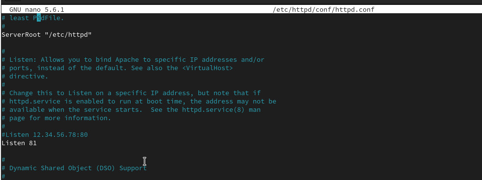

---
## Front matter
lang: ru-RU
title: 6-ая лабораторная работа
author: |
	Andrianova Marina Georgievna
institute: |
	\RUDN University, Moscow, Russian Federation
date: 2024, 10 October, Moscow

## Formatting
toc: false
slide_level: 2
theme: metropolis
header-includes: 
 - \metroset{progressbar=frametitle,sectionpage=progressbar,numbering=fraction}
 - '\makeatletter'
 - '\beamer@ignorenonframefalse'
 - '\makeatother'
aspectratio: 43
section-titles: true
---

## Цель работы

Развить навыки администрирования ОС Linux. Получить первое практическое знакомство с технологией SELinux. Проверить работу SELinux на практике совместно с веб-сервером Apache.

## Выполнение лабораторной работы

Вошла в систему под своей учетной записью. Убедилась, что SELinux работает в режиме enforcing политики targeted с помощью команд getenforce и sestatus (рис. [-@fig:001]).

{#fig:001 width=70%}

Запускаю сервер apache, далее обращаюсь с помощью браузера к веб-серверу, запущенному на компьютере, он работает, что видно из вывода команды `service httpd status` (рис. [-@fig:002]).

{#fig:002 width=70%}

С помощью команды `ps auxZ | grep httpd` нашла веб-сервер Apache в списке процессов. Его контекст безопасности - httpd_t (рис. [-@fig:003]).

{#fig:003 width=70%}

В директории `/var/www/html` нет файлов. (рис. [-@fig:004]).

{#fig:004 width=70%}

Создать файл может только суперпользователь, поэтому от его имени создаем файл test.html cо следующим содержанием:
```
<html>
<body>test</body>
</html>
```
(рис. [-@fig:005]).

{#fig:005 width=70%}

Проверяю контекст созданного файла. По умолчанию это httpd_sys_content_t (рис. [-@fig:006]).

{#fig:006 width=70%}

Обращаюсь к файлу через веб-сервер, введя в браузере адрес http://127.0.0.1/test.html. Файл был успешно отображён (рис. [-@fig:007]).

{#fig:007 width=70%}

Изменяю контекст файла `/var/www/html/test.html` с `httpd_sys_content_t` на любой другой, к которому процесс httpd не должен иметь доступа, например, `на samba_share_t`:
`chcon -t samba_share_t /var/www/html/test.html`
`ls -Z /var/www/html/test.html`
Контекст действительно поменялся (рис. [-@fig:008]).

{#fig:008 width=70%}

При попытке отображения файла в браузере получаем сообщение об ошибке (рис. [-@fig:009]).

{#fig:009 width=70%}

Чтобы запустить веб-сервер Apache на прослушивание ТСР-порта 81 (а не 80, как рекомендует IANA и прописано в /etc/services) открываю файл /etc/httpd/httpd.conf для изменения. (рис. [-@fig:010]).

{#fig:010 width=70%}

Нахожу строчку Listen 80 и заменяю её на Listen 81.  (рис. [-@fig:011]).

{#fig:011 width=70%}

Выполняю перезапуск веб-сервера Apache. Произошёл сбой, потому что порт 80 для локальной сети, а 81 нет (рис. [-@fig:012]).

{#fig:012 width=70%}

Просмотрела файл `/var/log/http/error_log`. Запись появилась в файле error_log (рис. [-@fig:013]).

{#fig:013 width=70%}

Выполняю команду
`semanage port -a -t http_port_t -р tcp 81`
После этого проверяю список портов командой
`semanage port -l | grep http_port_t`
Порт 81 появился в списке (рис. [-@fig:014]).

{#fig:014 width=70%}

Перезапускаю сервер Apache (рис. [-@fig:015]).

{#fig:015 width=70%}

Теперь он работает, ведь мы внесли порт 81 в список портов `http_port_t` (рис. [-@fig:016]).

{#fig:016 width=70%}

Возвращаю в файле /etc/httpd/httpd.conf порт 80, вместо 81. Проверяю, что порт 81 удален, это правда. (рис. [-@fig:017]).

{#fig:017 width=70%}

Далее удаляю файл test.html, проверяю, что он удален(рис. [-@fig:018]).

{#fig:018 width=70%}

## Выводы

В ходе выполнения данной лабораторной работы были развиты навыки администрирования ОС Linux, получено первое практическое знакомство с технологией SELinux и проверена работа SELinux на практике совместно с веб-сервером Apache.