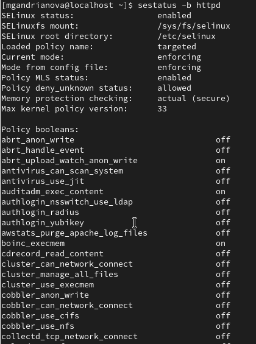

---
## Front matter
title: "Отчёт по лабораторной работе №6"
subtitle: "Дисциплина: Информационная безопасность"
author: "Андрианова Марина Георгиевна"

## Generic otions
lang: ru-RU
toc-title: "Содержание"

## Bibliography
bibliography: bib/cite.bib
csl: pandoc/csl/gost-r-7-0-5-2008-numeric.csl

## Pdf output format
toc: true # Table of contents
toc-depth: 2
lof: true # List of figures
lot: true # List of tables
fontsize: 12pt
linestretch: 1.5
papersize: a4
documentclass: scrreprt
## I18n polyglossia
polyglossia-lang:
  name: russian
  options:
	- spelling=modern
	- babelshorthands=true
polyglossia-otherlangs:
  name: english
## I18n babel
babel-lang: russian
babel-otherlangs: english
## Fonts
mainfont: IBM Plex Serif
romanfont: IBM Plex Serif
sansfont: IBM Plex Sans
monofont: IBM Plex Mono
mathfont: STIX Two Math
mainfontoptions: Ligatures=Common,Ligatures=TeX,Scale=0.94
romanfontoptions: Ligatures=Common,Ligatures=TeX,Scale=0.94
sansfontoptions: Ligatures=Common,Ligatures=TeX,Scale=MatchLowercase,Scale=0.94
monofontoptions: Scale=MatchLowercase,Scale=0.94,FakeStretch=0.9
mathfontoptions:
## Biblatex
biblatex: true
biblio-style: "gost-numeric"
biblatexoptions:
  - parentracker=true
  - backend=biber
  - hyperref=auto
  - language=auto
  - autolang=other*
  - citestyle=gost-numeric
## Pandoc-crossref LaTeX customization
figureTitle: "Рис."
tableTitle: "Таблица"
listingTitle: "Листинг"
lofTitle: "Список иллюстраций"
lotTitle: "Список таблиц"
lolTitle: "Листинги"
## Misc options
indent: true
header-includes:
  - \usepackage{indentfirst}
  - \usepackage{float} # keep figures where there are in the text
  - \floatplacement{figure}{H} # keep figures where there are in the text
---

# Цель работы

Развить навыки администрирования ОС Linux. Получить первое практическое знакомство с технологией SELinux. Проверить работу SELinx на практике совместно с веб-сервером Apache.

# Выполнение лабораторной работы

Вошла в систему под своей учетной записью. Убедилась, что SELinux работает в режиме enforcing политики targeted с помощью команд getenforce и sestatus (рис. [-@fig:001]).

{#fig:001 width=70%}

Запускаю сервер apache, далее обращаюсь с помощью браузера к веб-серверу, запущенному на компьютере, он работает, что видно из вывода команды `service httpd status` (рис. [-@fig:002]).

{#fig:002 width=70%}

С помощью команды `ps auxZ | grep httpd` нашла веб-сервер Apache в списке процессов. Его контекст безопасности - httpd_t (рис. [-@fig:003]).

{#fig:003 width=70%}

Просмотрела текущее состояние переключателей SELinux для Apache с помощью команды `sestatus -bigrep httpd` (рис. [-@fig:004]).

{#fig:004 width=70%}

Просмотрела статистику по политике с помощью команды `seinfo`. Множество пользователей - 8, ролей - 40, типов - 5145. (рис. [-@fig:005]).

{#fig:005 width=70%}

Типы поддиректорий, находящихся в директории `/var/www`, нашли с помощью команды `ls -lZ /var/www`, они следующие: владелец - root, права на изменения только у владельца. Файлов в директории нет (рис. [-@fig:006]).

{#fig:006 width=70%}

В директории `/var/www/html` нет файлов. (рис. [-@fig:007]).

{#fig:007 width=70%}

Создать файл может только суперпользователь, поэтому от его имени создаем файл touch.html cо следующим содержанием:
```html
<html>
<body>test</body>
</html>
```
(рис. [-@fig:008]).

{#fig:008 width=70%}

Проверяю контекст созданного файла. По умолчанию это httpd_sys_content_t (рис. [-@fig:009]).

{#fig:009 width=70%}

Обращаюсь к файлу через веб-сервер, введя в браузере адрес http://127.0.0.1/test.html. Файл был успешно отображён (рис. [-@fig:010]).

{#fig:010 width=70%}

Изучила справку man httpd_selinux. Справочной страницы не оказалось (рис. [-@fig:011]).
Проверила контекст файла командой ls -Z. Рассмотрим полученный контекст детально. Так как по умолчанию пользователи CentOS являются свободными от типа
(unconfined в переводе с англ. означает свободный), созданному нами файлу test.html был сопоставлен SELinux, пользователь unconfined_u. Это первая часть контекста. Далее политика ролевого разделения доступа RBAC используется процессами, но не файлами, поэтому роли не имеют никакого значения для
файлов. Роль object_r используется по умолчанию для файлов на «постоянных» носителях и на сетевых файловых системах. (В директории /ргос файлы, относящиеся к процессам, могут иметь роль system_r. Если активна политика MLS, то могут использоваться и другие роли, например, secadm_r. Данный случай мы рассматривать не будем, как и предназначение :s0). Тип httpd_sys_content_t позволяет процессу httpd получить доступ к файлу. Благодаря наличию последнего типа мы получили доступ к файлу при обращении к нему через браузер. (рис. [-@fig:011]).

{#fig:011 width=70%}

Изменяю контекст файла `/var/www/html/test.html` с `httpd_sys_content_t` на любой другой, к которому процесс httpd не должен иметь доступа, например, `на samba_share_t`:
`chcon -t samba_share_t /var/www/html/test.html`
`ls -Z /var/www/html/test.html`
Контекст действительно поменялся (рис. [-@fig:012]).

{#fig:012 width=70%}

При попытке отображения файла в браузере получаем сообщение об ошибке (рис. [-@fig:013]).

{#fig:013 width=70%}

Файл не был отображён, хотя права доступа позволяют читать этот файл любому пользователю (рис. [-@fig:014]), потому что установлен контекст, к которому процесс httpd не должен иметь доступа.

{#fig:014 width=70%}

Просматриваю log-файлы веб-сервера Apache (рис. [-@fig:015]) и системный лог-файл: `tail /var/log/messages`(рис. [-@fig:016]).

{#fig:015 width=70%}

{#fig:016 width=70%}

Чтобы запустить веб-сервер Apache на прослушивание ТСР-порта 81 (а не 80, как рекомендует IANA и прописано в /etc/services) открываю файл /etc/httpd/httpd.conf для изменения. (рис. [-@fig:017]).

{#fig:017 width=70%}

Нахожу строчку Listen 80 и заменяю её на Listen 81.  (рис. [-@fig:018]).

{#fig:018 width=70%}

Выполняю перезапуск веб-сервера Apache. Произошёл сбой, потому что порт 80 для локальной сети, а 81 нет (рис. [-@fig:019]).

{#fig:019 width=70%}

Проанализируем лог-файлы:
`tail -nl /var/log/messages`
 (рис. [-@fig:020]).

{#fig:020 width=70%}

Просмотрела файлы `/var/log/http/error_log`(рис. [-@fig:021]), `/var/log/http/access_log`(рис. [-@fig:022]) и `/var/log/audit/audit.log`(рис. [-@fig:023]) и выяснила, в каких файлах появились записи. Запись появилась в файле error_log (рис. [-@fig:021]).

{#fig:021 width=70%}

{#fig:022 width=70%}

{#fig:023 width=70%}

Выполняю команду
`semanage port -a -t http_port_t -р tcp 81`
После этого проверяю список портов командой
`semanage port -l | grep http_port_t`
Порт 81 появился в списке (рис. [-@fig:024]).

{#fig:024 width=70%}

Перезапускаю сервер Apache (рис. [-@fig:025]).

{#fig:025 width=70%}

Теперь он работает, ведь мы внесли порт 81 в список портов `htttpd_port_t` (рис. [-@fig:026]).

{#fig:026 width=70%}

Возвращаю в файле /etc/httpd/httpd.conf порт 80, вместо 81. Проверяю, что порт 81 удален, это правда. (рис. [-@fig:027]).

{#fig:027 width=70%}

Далее удаляю файл test.html, проверяю, что он удален(рис. [-@fig:028]).

{#fig:028 width=70%}

# Выводы

В ходе выполнения данной лабораторной работы были развиты навыки администрирования ОС Linux, получено первое практическое знакомство с технологией SELinux и проверена работа SELinux на практике совместно с веб-сервером Apache.