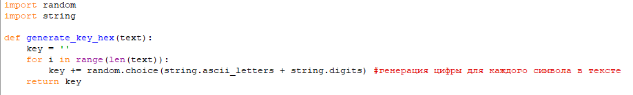
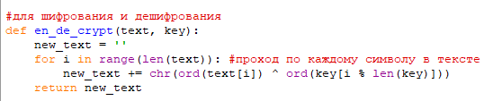
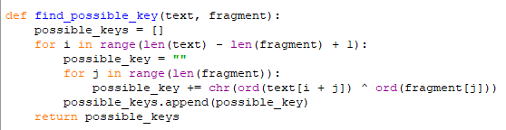
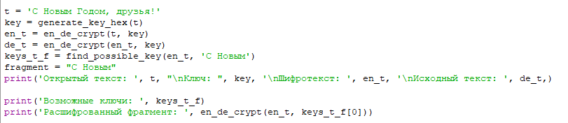
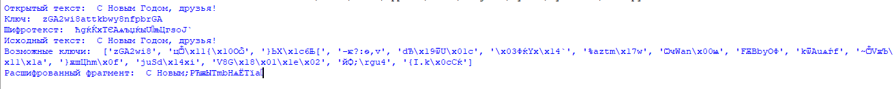

---
## Front matter
lang: ru-RU
title: 7-ая лабораторная работа
author: |
	Andrianova Marina Georgievna
institute: |
	\RUDN University, Moscow, Russian Federation
date: 2024, 15 October, Moscow

## Formatting
toc: false
slide_level: 2
theme: metropolis
header-includes: 
 - \metroset{progressbar=frametitle,sectionpage=progressbar,numbering=fraction}
 - '\makeatletter'
 - '\beamer@ignorenonframefalse'
 - '\makeatother'
aspectratio: 43
section-titles: true
---

## Цель работы

Освоить на практике применение режима однократного гаммирования.

## Выполнение лабораторной работы

Я выполняла лабораторную работу на языке программирования Python.

Требуется разработать программу, позволяющую шифровать и дешифровать данные в режиме однократного гаммирования. Начнем с создания функции для генерации случайного ключа (рис. [-@fig:001]).

{#fig:001 width=70%}

Необходимо определить вид шифротекста при известном ключе и известном открытом тексте. Делаю одну функцию и для шифрования, и для дешифрования текста (рис. [-@fig:002]).

{#fig:002 width=70%}

Нужно определить ключ, с помощью которого шифротекст может быть преобразован в некоторый фрагмент текста, представляющий собой один из возможных вариантов прочтения открытого текста. Для этого создаю функцию для нахождения возможных ключей для фрагмента текста (рис. [-@fig:003]). 

{#fig:003 width=70%}

В следующей части кода реализуем шифрование и дешифрование текста, а также поиск возможных ключей для расшифровки (рис. [-@fig:004]).

{#fig:004 width=70%}

Проверка работы всех функций. Шифрование и дешифрование происходит верно, как и нахождение ключей, с помощью которых можно расшифровать верно только кусок текста (рис. [-@fig:005]).

{#fig:005 width=70%}

## Выводы

В ходе выполнения данной лабораторной работы я освоила на практике применение режима однократного гаммирования.