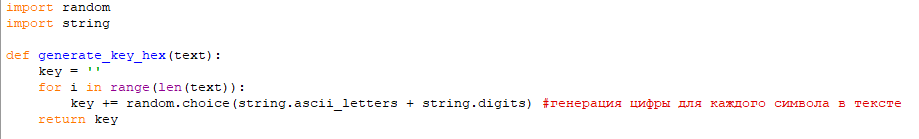
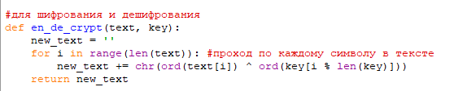
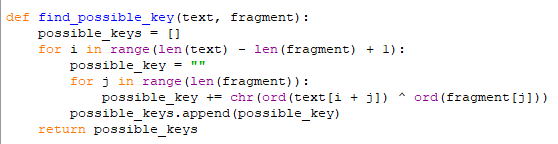
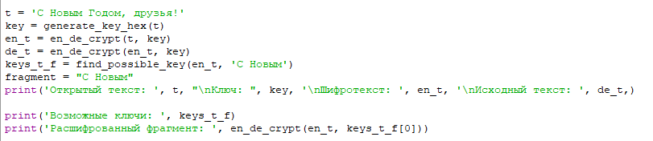
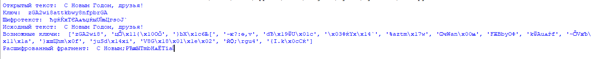

---
## Front matter
title: "Отчёт по лабораторной работе №7"
subtitle: "Дисциплина: Информационная безопасность"
author: "Андрианова Марина Георгиевна"

## Generic otions
lang: ru-RU
toc-title: "Содержание"

## Bibliography
bibliography: bib/cite.bib
csl: pandoc/csl/gost-r-7-0-5-2008-numeric.csl

## Pdf output format
toc: true # Table of contents
toc-depth: 2
lof: true # List of figures
lot: true # List of tables
fontsize: 12pt
linestretch: 1.5
papersize: a4
documentclass: scrreprt
## I18n polyglossia
polyglossia-lang:
  name: russian
  options:
	- spelling=modern
	- babelshorthands=true
polyglossia-otherlangs:
  name: english
## I18n babel
babel-lang: russian
babel-otherlangs: english
## Fonts
mainfont: IBM Plex Serif
romanfont: IBM Plex Serif
sansfont: IBM Plex Sans
monofont: IBM Plex Mono
mathfont: STIX Two Math
mainfontoptions: Ligatures=Common,Ligatures=TeX,Scale=0.94
romanfontoptions: Ligatures=Common,Ligatures=TeX,Scale=0.94
sansfontoptions: Ligatures=Common,Ligatures=TeX,Scale=MatchLowercase,Scale=0.94
monofontoptions: Scale=MatchLowercase,Scale=0.94,FakeStretch=0.9
mathfontoptions:
## Biblatex
biblatex: true
biblio-style: "gost-numeric"
biblatexoptions:
  - parentracker=true
  - backend=biber
  - hyperref=auto
  - language=auto
  - autolang=other*
  - citestyle=gost-numeric
## Pandoc-crossref LaTeX customization
figureTitle: "Рис."
tableTitle: "Таблица"
listingTitle: "Листинг"
lofTitle: "Список иллюстраций"
lotTitle: "Список таблиц"
lolTitle: "Листинги"
## Misc options
indent: true
header-includes:
  - \usepackage{indentfirst}
  - \usepackage{float} # keep figures where there are in the text
  - \floatplacement{figure}{H} # keep figures where there are in the text
---

# Цель работы

Освоить на практике применение режима однократного гаммирования.

# Выполнение лабораторной работы

Я выполняла лабораторную работу на языке программирования Python, листинг программы и результаты выполнения приведены в отчете.

Требуется разработать программу, позволяющую шифровать и дешифровать данные в режиме однократного гаммирования. Начнем с создания функции для генерации случайного ключа (рис. [-@fig:001]).

{#fig:001 width=70%}

Необходимо определить вид шифротекста при известном ключе и известном открытом тексте. Делаю одну функцию и для шифрования, и для дешифрования текста (рис. [-@fig:002]).

{#fig:002 width=70%}

Нужно определить ключ, с помощью которого шифротекст может быть преобразован в некоторый фрагмент текста, представляющий собой один из возможных вариантов прочтения открытого текста. Для этого создаю функцию для нахождения возможных ключей для фрагмента текста (рис. [-@fig:003]). 

{#fig:003 width=70%}

В следующей части кода реализуем шифрование и дешифрование текста, а также поиск возможных ключей для расшифровки (рис. [-@fig:004]).

{#fig:004 width=70%}

Проверка работы всех функций. Шифрование и дешифрование происходит верно, как и нахождение ключей, с помощью которых можно расшифровать верно только кусок текста (рис. [-@fig:005]).

{#fig:005 width=70%}

Листинг программы 1:

```python

import random
import string

def generate_key_hex(text):
    key = ''
    for i in range(len(text)):
        key += random.choice(string.ascii_letters + string.digits) #генерация цифры для каждого символа в тексте
    return key

#для шифрования и дешифрования
def en_de_crypt(text, key):
    new_text = ''
    for i in range(len(text)): #проход по каждому символу в тексте
        new_text += chr(ord(text[i]) ^ ord(key[i % len(key)]))
    return new_text

def find_possible_key(text, fragment):
    possible_keys = []
    for i in range(len(text) - len(fragment) + 1):
        possible_key = ""
        for j in range(len(fragment)):
            possible_key += chr(ord(text[i + j]) ^ ord(fragment[j]))
        possible_keys.append(possible_key)
    return possible_keys

t = 'С Новым Годом, друзья!'
key = generate_key_hex(t)
en_t = en_de_crypt(t, key)
de_t = en_de_crypt(en_t, key)
keys_t_f = find_possible_key(en_t, 'С Новым')
fragment = "С Новым"
print('Открытый текст: ', t, "\nКлюч: ", key, '\nШифротекст: ', en_t, '\nИсходный текст: ', de_t,)

print('Возможные ключи: ', keys_t_f)
print('Расшифрованный фрагмент: ', en_de_crypt(en_t, keys_t_f[0]))
```

# Ответы на контрольные вопросы

1. Поясните смысл однократного гаммирования. - Однократное гаммирование - это метод шифрования, при котором каждый символ открытого текста гаммируется с соответствующим символом ключа только один раз.

2. Перечислите недостатки однократного гаммирования. - Недостатки однократного гаммирования:
- Уязвимость к частотному анализу из-за сохранения частоты символов открытого текста в шифротексте.
- Необходимость использования одноразового ключа, который должен быть длиннее самого открытого текста.
- Нет возможности использовать один ключ для шифрования разных сообщений.

3. Перечислите преимущества однократного гаммирования. - Преимущества однократного гаммирования:
- Высокая стойкость при правильном использовании случайного ключа.
- Простота реализации алгоритма.
- Возможность использования случайного ключа.

4. Почему длина открытого текста должна совпадать с длиной ключа? - Длина открытого текста должна совпадать с длиной ключа, чтобы каждый символ открытого текста гаммировался с соответствующим символом ключа.

5. Какая операция используется в режиме однократного гаммирования, назовите её особенности? - В режиме однократного гаммирования используется операция XOR (исключающее ИЛИ), которая объединяет двоичные значения символов открытого текста и ключа для получения шифротекста. Особенность XOR - если один из битов равен 1, то результат будет 1, иначе 0.

6. Как по открытому тексту и ключу получить шифротекст? - Для получения шифротекста по открытому тексту и ключу каждый символ открытого текста гаммируется с соответствующим символом ключа с помощью операции XOR.
 
7. Как по открытому тексту и шифротексту получить ключ? - По открытому тексту и шифротексту невозможно восстановить действительный ключ, так как для этого нужна информация о каждом символе ключа. 

8. В чем заключаются необходимые и достаточные условия абсолютной стойкости шифра - Необходимые и достаточные условия абсолютной стойкости шифра:
- Ключи должны быть случайными и использоваться только один раз.
- Длина ключа должна быть не менее длины самого открытого текста.
- Ключи должны быть храниться и передаваться безопасным способом.

# Выводы

В ходе выполнения данной лабораторной работы я освоила на практике применение режима однократного гаммирования.