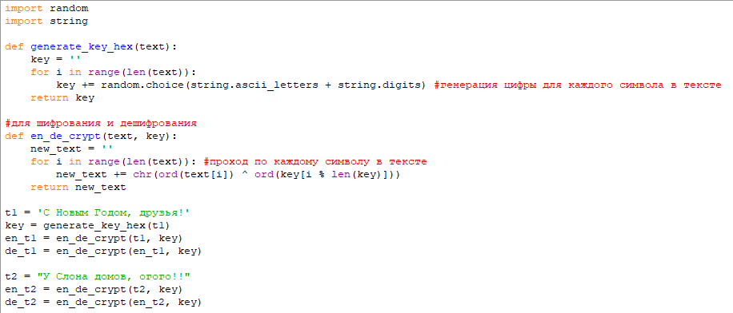
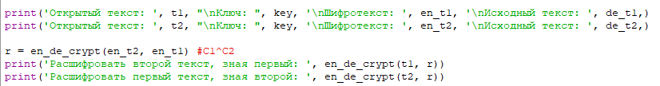
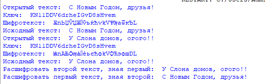

---
## Front matter
lang: ru-RU
title: 8-ая лабораторная работа
author: |
	Andrianova Marina Georgievna
institute: |
	\RUDN University, Moscow, Russian Federation
date: 2024, 15 October, Moscow

## Formatting
toc: false
slide_level: 2
theme: metropolis
header-includes: 
 - \metroset{progressbar=frametitle,sectionpage=progressbar,numbering=fraction}
 - '\makeatletter'
 - '\beamer@ignorenonframefalse'
 - '\makeatother'
aspectratio: 43
section-titles: true
---

## Цель работы

Освоить на практике применение режима однократного гаммирования на примере кодирования различных исходных текстов одним ключом.

## Выполнение лабораторной работы

Я выполняла лабораторную работу на языке программирования Python, используя функции, реализованные в лабораторной работе №7.

Используя функцию для генерации ключа, генерирую ключ, затем шифрую два разных текста одним и тем же ключом (рис. [-@fig:001]).

{#fig:001 width=70%}

Расшифровываю оба текста сначала с помощью одного ключа, затем предполагаю, что мне неизвестен ключ, но известен один из текстов и уже расшифровываю второй, зная шифротексты и первый текст (рис. [-@fig:002]).

{#fig:002 width=70%}

Запускаю написанный код (рис. [-@fig:003]).

{#fig:003 width=70%}

## Выводы

В ходе лабораторной работы я освоила на практике навыки применения режима однократного гаммирования на примере кодирования различных исходных текстов одним ключом.