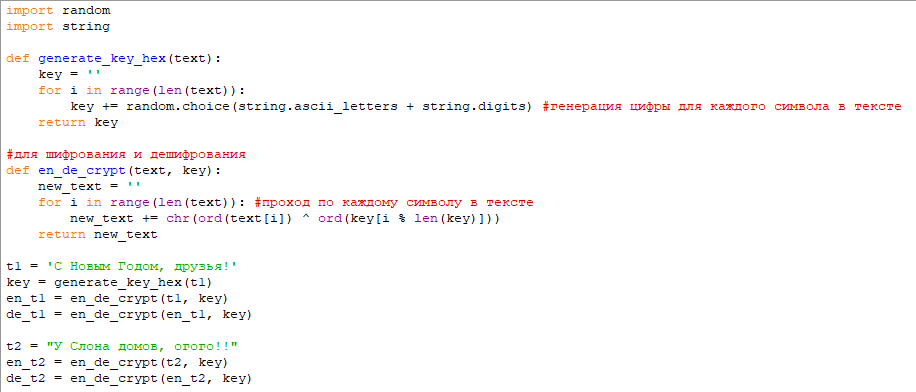
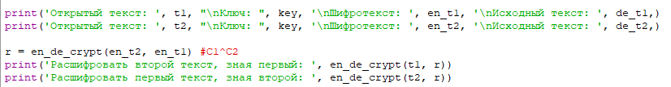
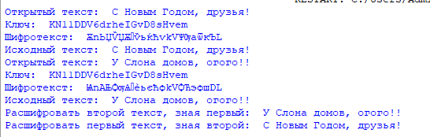

---
## Front matter
title: "Отчёт по лабораторной работе №8"
subtitle: "Дисциплина: Информационная безопасность"
author: "Андрианова Марина Георгиевна"

## Generic otions
lang: ru-RU
toc-title: "Содержание"

## Bibliography
bibliography: bib/cite.bib
csl: pandoc/csl/gost-r-7-0-5-2008-numeric.csl

## Pdf output format
toc: true # Table of contents
toc-depth: 2
lof: true # List of figures
lot: true # List of tables
fontsize: 12pt
linestretch: 1.5
papersize: a4
documentclass: scrreprt
## I18n polyglossia
polyglossia-lang:
  name: russian
  options:
	- spelling=modern
	- babelshorthands=true
polyglossia-otherlangs:
  name: english
## I18n babel
babel-lang: russian
babel-otherlangs: english
## Fonts
mainfont: IBM Plex Serif
romanfont: IBM Plex Serif
sansfont: IBM Plex Sans
monofont: IBM Plex Mono
mathfont: STIX Two Math
mainfontoptions: Ligatures=Common,Ligatures=TeX,Scale=0.94
romanfontoptions: Ligatures=Common,Ligatures=TeX,Scale=0.94
sansfontoptions: Ligatures=Common,Ligatures=TeX,Scale=MatchLowercase,Scale=0.94
monofontoptions: Scale=MatchLowercase,Scale=0.94,FakeStretch=0.9
mathfontoptions:
## Biblatex
biblatex: true
biblio-style: "gost-numeric"
biblatexoptions:
  - parentracker=true
  - backend=biber
  - hyperref=auto
  - language=auto
  - autolang=other*
  - citestyle=gost-numeric
## Pandoc-crossref LaTeX customization
figureTitle: "Рис."
tableTitle: "Таблица"
listingTitle: "Листинг"
lofTitle: "Список иллюстраций"
lotTitle: "Список таблиц"
lolTitle: "Листинги"
## Misc options
indent: true
header-includes:
  - \usepackage{indentfirst}
  - \usepackage{float} # keep figures where there are in the text
  - \floatplacement{figure}{H} # keep figures where there are in the text
---

# Цель работы

Освоить на практике применение режима однократного гаммирования на примере кодирования различных исходных текстов одним ключом.

# Выполнение лабораторной работы

Я выполняла лабораторную работу на языке программирования Python, используя функции, реализованные в лабораторной работе №7.

Используя функцию для генерации ключа, генерирую ключ, затем шифрую два разных текста одним и тем же ключом (рис. [-@fig:001]).

{#fig:001 width=70%}

Расшифровываю оба текста сначала с помощью одного ключа, затем предполагаю, что мне неизвестен ключ, но известен один из текстов и уже расшифровываю второй, зная шифротексты и первый текст (рис. [-@fig:002]).

{#fig:002 width=70%}

Запускаю написанный код (рис. [-@fig:003]).

{#fig:003 width=70%}

Листинг программы 1
```python

import random
import string

def generate_key_hex(text):
    key = ''
    for i in range(len(text)):
        key += random.choice(string.ascii_letters + string.digits) #генерация цифры для каждого символа в тексте
    return key

#для шифрования и дешифрования
def en_de_crypt(text, key):
    new_text = ''
    for i in range(len(text)): #проход по каждому символу в тексте
        new_text += chr(ord(text[i]) ^ ord(key[i % len(key)]))
    return new_text

t1 = 'С Новым Годом, друзья!'
key = generate_key_hex(t1)
en_t1 = en_de_crypt(t1, key)
de_t1 = en_de_crypt(en_t1, key)

t2 = "У Слона домов, огого!!"
en_t2 = en_de_crypt(t2, key)
de_t2 = en_de_crypt(en_t2, key)

print('Открытый текст: ', t1, "\nКлюч: ", key, '\nШифротекст: ', en_t1, '\nИсходный текст: ', de_t1,)
print('Открытый текст: ', t2, "\nКлюч: ", key, '\nШифротекст: ', en_t2, '\nИсходный текст: ', de_t2,)

r = en_de_crypt(en_t2, en_t1) #С1^C2
print('Расшифровать второй текст, зная первый: ', en_de_crypt(t1, r))
print('Расшифровать первый текст, зная второй: ', en_de_crypt(t2, r))
```

# Ответы на контрольные вопросы

1. Как, зная один из текстов ($P_1$ или $P_2$), определить другой, не зная при этом ключа? - Для определения другого текста ($P_2$) можно просто взять зашифрованные тексты $C_1 ⊕ C_2$, далее применить XOR к ним и к известному тексту: $C_1 ⊕ C_2 ⊕ P_1 = P_2$.

2. Что будет при повторном использовании ключа при шифровании текста? - При повторном использовании ключа мы получим дешифрованный текст.

3. Как реализуется режим шифрования однократного гаммирования одним ключом двух открытых текстов? - Режим шифрования однократного гаммирования одним ключом двух открытых текстов осуществляется путем XOR-ирования каждого бита первого текста с соответствующим битом ключа или второго текста.

4. Перечислите недостатки шифрования одним ключом двух открытых текстов - Недостатки шифрования одним ключом двух открытых текстов включают возможность раскрытия ключа или текстов при известном открытом тексте.

5. Перечислите преимущества шифрования одним ключом двух открытых текстов - Преимущества шифрования одним ключом двух открытых текстов включают использование одного ключа для зашифрования нескольких сообщений без необходимости создания нового ключа и выделения на него памяти.

# Выводы

В ходе лабораторной работы я освоила на практике навыки применения режима однократного гаммирования на примере кодирования различных исходных текстов одним ключом.