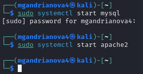
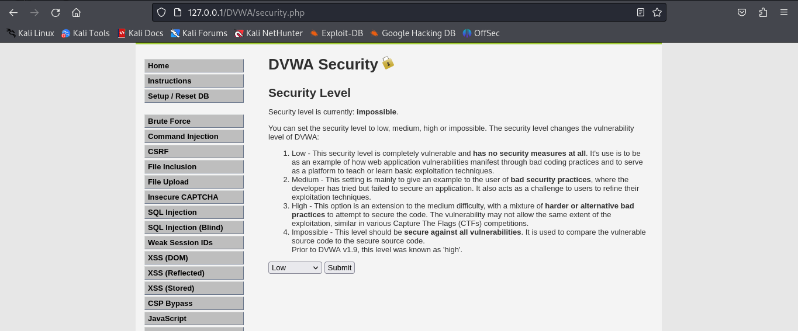
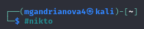
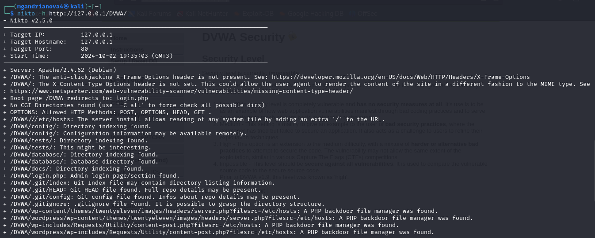
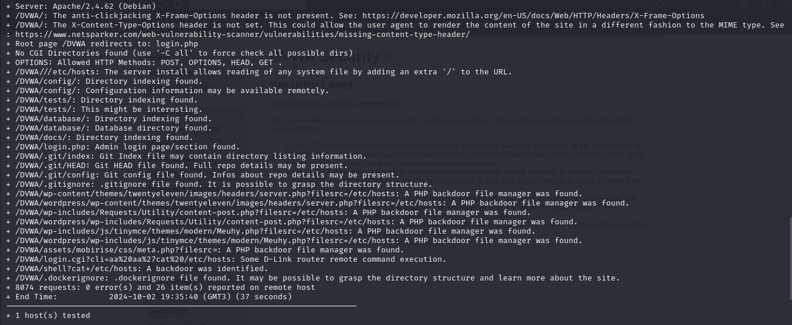
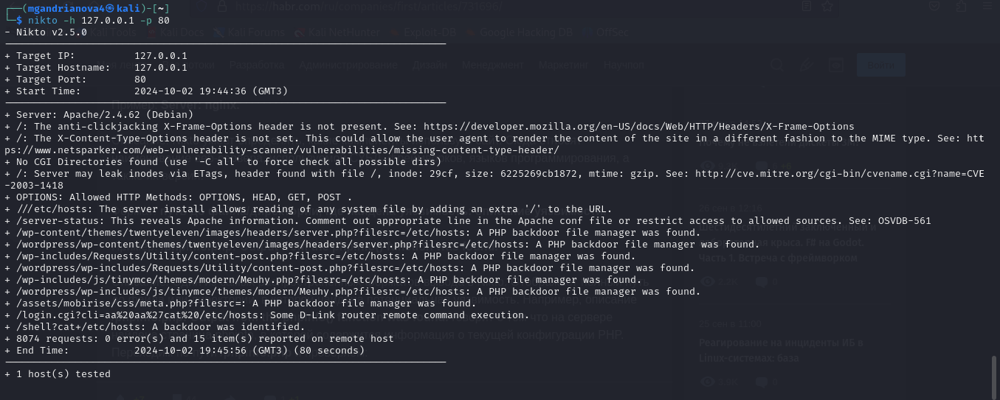

---
## Front matter
lang: ru-RU
title: Индивидуальный проект, 4 этап
author: |
	Andrianova Marina Georgievna
institute: |
	\RUDN University, Moscow, Russian Federation
date: 2024, 02 October, Moscow

## Formatting
toc: false
slide_level: 2
theme: metropolis
header-includes: 
 - \metroset{progressbar=frametitle,sectionpage=progressbar,numbering=fraction}
 - '\makeatletter'
 - '\beamer@ignorenonframefalse'
 - '\makeatother'
aspectratio: 43
section-titles: true
---

## Цель работы

Целью данной работы является обучение тестированию веб-приложений с помощью сканера nikto в Kali Linux.

# Задание

Использование nikto.

## Выполнение 4-го этапа индивидуального проекта

Чтобы работать с nikto, необходимо подготовить веб-приложение, которое будем сканировать. Это будет DVWA. Для этого запустила mysql и apache2 (рис. 1).

{#fig:001 width=70%}

Ввожу в адресной строке браузера адрес DVWA, перехожу в режим выбора уровня безопасности, ставлю минимальный (рис. 2).

{#fig:002 width=70%}

Запускаю nikto (рис. 3).

{#fig:003 width=70%}

Проверить веб-приложение можно, введя его полный URL и не вводя порт, сначала пробуем так (рис. 4-5).

{#fig:004 width=70%}

{#fig:005 width=70%}

Затем попробовала просканировать, введя адрес хоста и адрес порта, результаты незначительно отличаются (рис. 6).

{#fig:006 width=70%}

# Выводы

Научилась использовать сканер nikto для тестирования веб-приложений в Kali Linux.