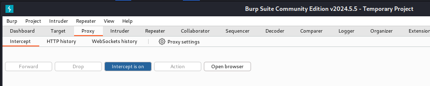
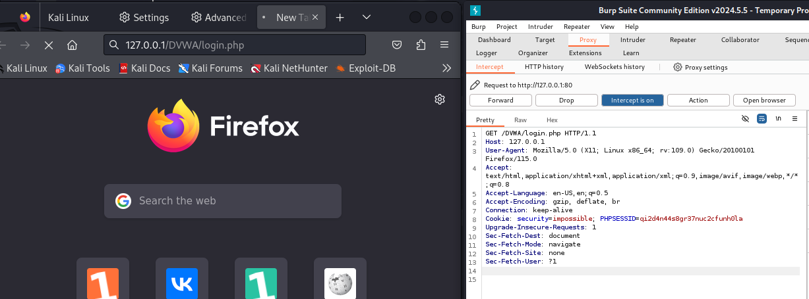
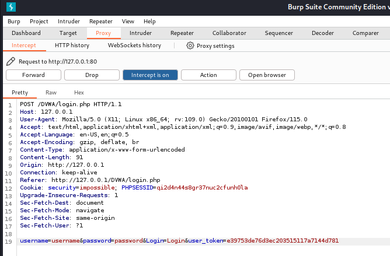
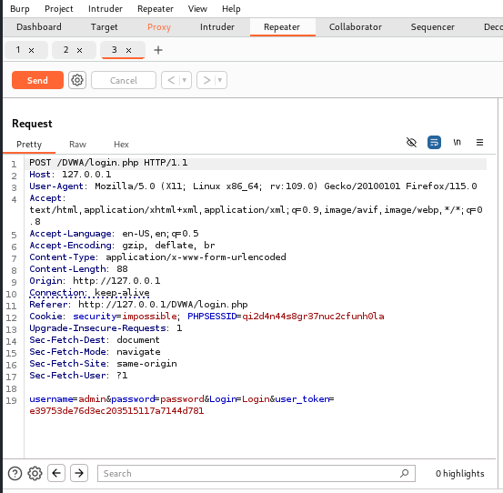
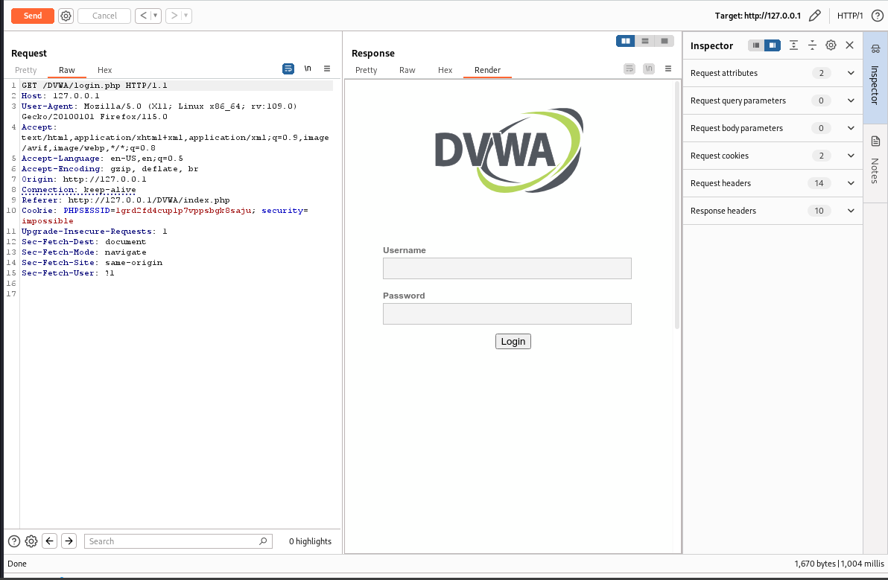

---
## Front matter
lang: ru-RU
title: Индивидуальный проект, 5 этап
author: |
	Andrianova Marina Georgievna
institute: |
	\RUDN University, Moscow, Russian Federation
date: 2024, 08 October, Moscow

## Formatting
toc: false
slide_level: 2
theme: metropolis
header-includes: 
 - \metroset{progressbar=frametitle,sectionpage=progressbar,numbering=fraction}
 - '\makeatletter'
 - '\beamer@ignorenonframefalse'
 - '\makeatother'
aspectratio: 43
section-titles: true
---

## Цель работы

Научиться использовать Burp Suite в Kali Linux.

## Задание

Использование Burp Suite.

## Выполнение 5-го этапа индивидуального проекта

Запускаю локальный сервер, на котором открываю веб-приложение DVWA для тестирования инструмента Burp Suite (рис. [-@fig:001]).

{#fig:001 width=70%}

## Выполнение 5-го этапа индивидуального проекта

Запускаю инструмент Burp Suite (рис. [-@fig:002]).

{#fig:002 width=70%}

## Выполнение 5-го этапа индивидуального проекта

Изменение настроек сервера для работы с proxy и захватом данных с помощью Burp Suite (рис. [-@fig:003]).

{#fig:003 width=70%}

## Выполнение 5-го этапа индивидуального проекта

Во вкладке Proxy меняю "Intercept is off" на "Intercept is on" (рис. [-@fig:004]).

{#fig:004 width=70%}

## Выполнение 5-го этапа индивидуального проекта

Чтобы Burp Suite исправно работал с локальным сервером, наобходимо установить параметр `network_allow_hijacking_loacalhost` на `true` (рис. [-@fig:005]).

{#fig:005 width=70%}

## Выполнение 5-го этапа индивидуального проекта

Пытаюсь зайти в браузере на DVWA, тут же во вкладки Proxy появляется захваченный запрос. Нажимаем "Forward", чтобы загрузить страницу (рис. [-@fig:006]).

{#fig:006 width=70%}

## Выполнение 5-го этапа индивидуального проекта

Загрузилась страница авторизации, текст запроса поменялся (рис. [-@fig:007]).

{#fig:007 width=70%}

## Выполнение 5-го этапа индивидуального проекта

Попробуем ввести неправильные, случайные данные в веб-приложении и нажмем `Login`. В запросе увидим строку, в которой отображаются введенные нами данные, то есть поле для ввода (рис. [-@fig:008]).

{#fig:008 width=70%}

## Выполнение 5-го этапа индивидуального проекта

Изменяем значение типа атаки на Cluster bomb и проставляем специальные символы у тех данных в форме для ввода, которые будем пробивать, то есть у имени пользователя и пароля (рис. [-@fig:009]).

{#fig:009 width=70%}

## Выполнение 5-го этапа индивидуального проекта

Так как мы отметили два параметра для подбора, то нам нужно два списка со значениями для подбора. Заполняем первый список в `Payload setting`. Переключаемся на второй список и добавляем значения в него. В строке request count видим нужное количество запросов, чтобы проверить все возможные пары пользователь-пароль (рис. [-@fig:010]).

{#fig:010 width=70%}

## Выполнение 5-го этапа индивидуального проекта

Запускаю атаку и начинаю подбор (рис. [-@fig:011]).

{#fig:011 width=70%}

## Выполнение 5-го этапа индивидуального проекта

При открытии результата каждого post-запроса можно увидеть полученный get-запрос, в нем видно, куда нас перенаправило после выполнения ввода пары пользователь-пароль. Проверим результат пары admin-password во вкладке Response, теперь нас перенаправляет на страницу index.php, значит пара должна быть верной (рис. [-@fig:012]).

{#fig:012 width=70%}

## Выполнение 5-го этапа индивидуального проекта

Дополнительная проверка с использованием Repeater, нажимаем на нужный нам запрос правой кнопкой мыши и жмем "Send to Repeater". Переходим во вкладку "Repeater" (рис. [-@fig:013]).

{#fig:013 width=70%}

## Выполнение 5-го этапа индивидуального проекта

Нажимаем "send", получаем в Response в результат перенаправление на index.php (рис. [-@fig:014]).

{#fig:014 width=70%}

## Выполнение 5-го этапа индивидуального проекта

После нажатия на `Follow redirection`, получим нескомпилированный html код в окне Response (рис. [-@fig:015]).

{#fig:015 width=70%}

## Выполнение 5-го этапа индивидуального проекта

Далее в подокне Render получим то, как выглядит полученная страница (рис. [-@fig:016]).

{#fig:016 width=70%}

## Выводы

При выполнении 5-го этапа индивидуального проекта научилась использовать инструмент Burp Suite в Kali Linux.

## Список литературы{.unnumbered}

1. Парасрам, Ш. Kali Linux: Тестирование на проникновение и безопасность : Для профессионалов. Kali Linux / Ш. Парасрам, А. Замм, Т. Хериянто, и др. – Санкт-Петербург : Питер, 2022. – 448 сс.