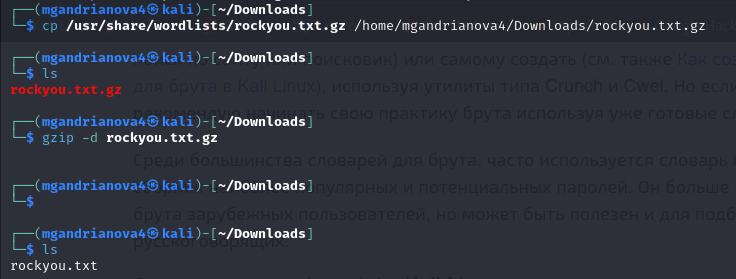
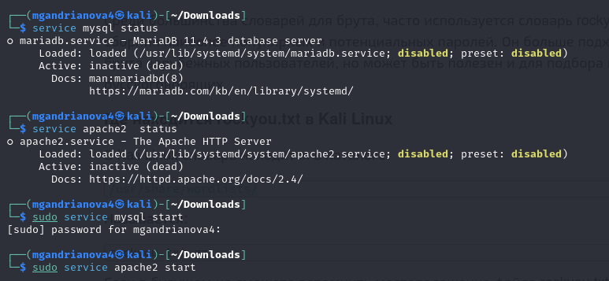
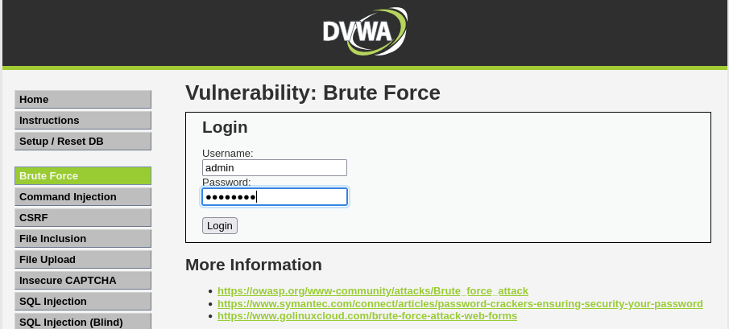
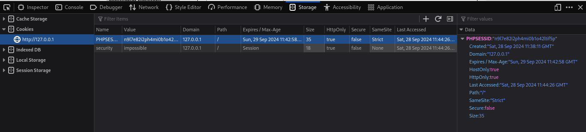
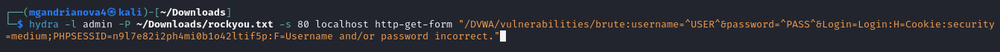
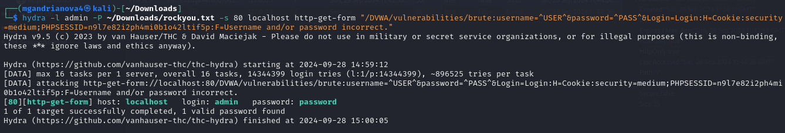
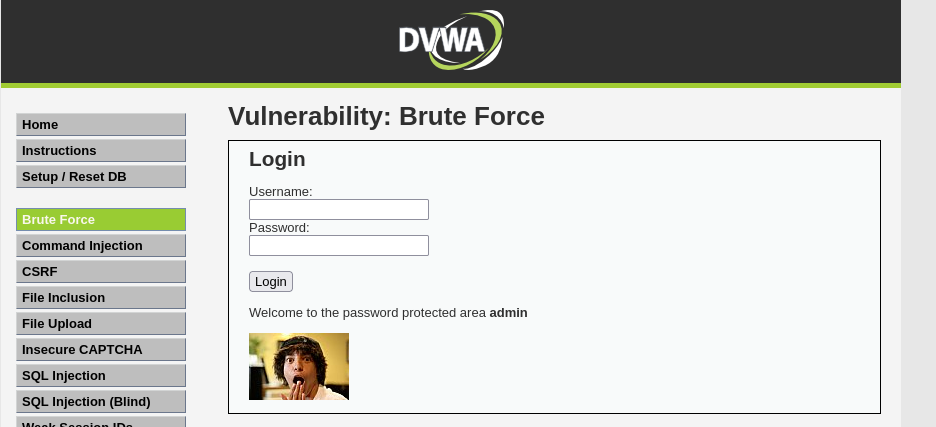

---
## Front matter
lang: ru-RU
title: Индивидуальный проект, 3 этап
author: |
	Andrianova Marina Georgievna
institute: |
	\RUDN University, Moscow, Russian Federation
date: 2024, 28 September, Moscow

## Formatting
toc: false
slide_level: 2
theme: metropolis
header-includes: 
 - \metroset{progressbar=frametitle,sectionpage=progressbar,numbering=fraction}
 - '\makeatletter'
 - '\beamer@ignorenonframefalse'
 - '\makeatother'
aspectratio: 43
section-titles: true
---

## Цель работы

Целью данной работы является приобретение практических навыков по использованию инструмента Hydra для подбора паролей в Kali Linux.

## Выполнение 3-го этапа индивидуального проекта

Скопируем архив rockyou.txt.gz в директорию Downloads и разархивируем его (рис.1).

{#fig:001 width=70%}

Запустим сервисы MySql и APache2(рис.2).

{#fig:002 width=70%}

Форма для взлома находится в разделе Brute Force (рис.3).

{#fig:003 width=70%}

Нам пригодятся фрагменты-cookie нашего приложения: PHPSESSID и security (рис.4).

{#fig:004 width=70%}

Воспользуемся утилитой hydra(рис.5).

{#fig:005 width=70%}

После выполнения команды видим, что утилита подобрала подходящий пароль (рис.6).

{#fig:006 width=70%}

Вводим подобранный пароль в соответствующее поле и успешно авторизуемся (рис.7).

{#fig:007 width=70%}

# Выводы

Приобрела практические навыки по использованию инструмента Hydra для подбора паролей в Kali Linux.