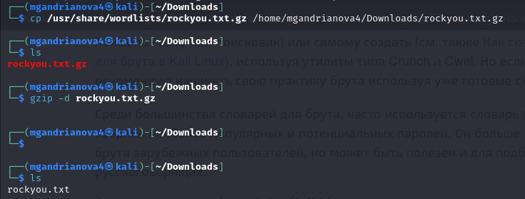
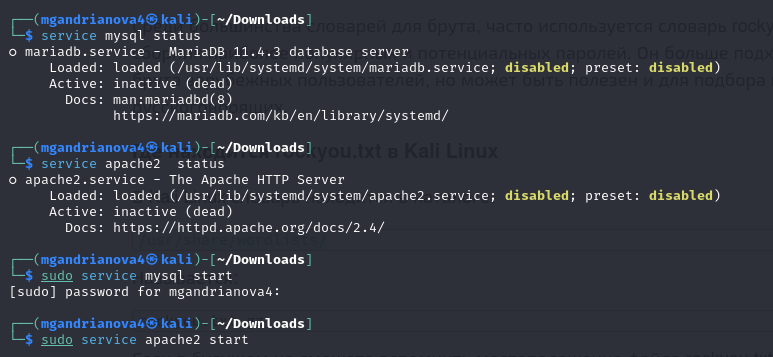
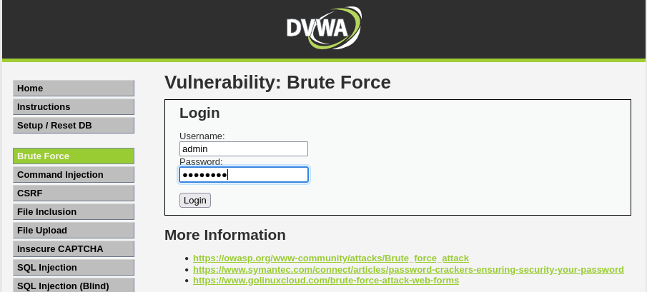
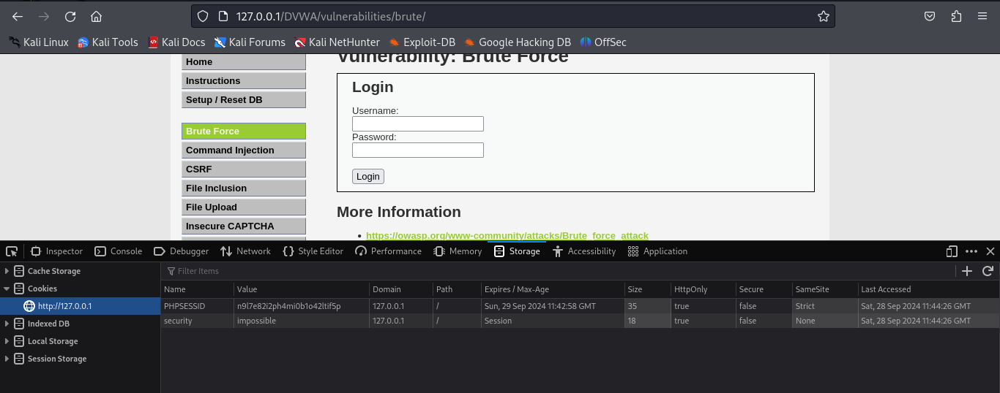
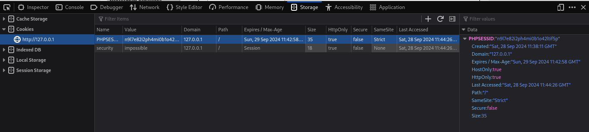
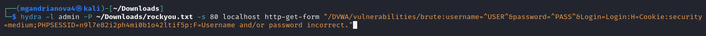
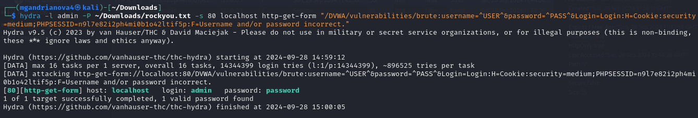
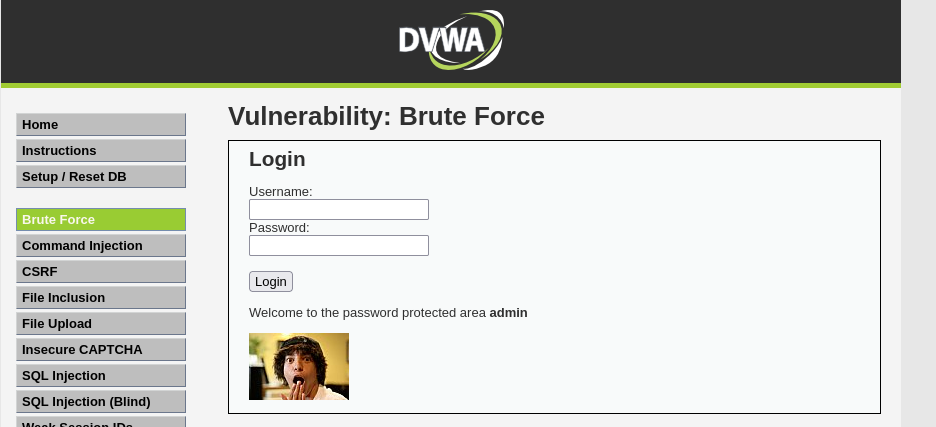

---
## Front matter
title: "Отчёт по 3 этапу индивидуального проекта"
subtitle: "Дисциплина: Информационная безопасность"
author: "Андрианова Марина Георгиевна"

## Generic otions
lang: ru-RU
toc-title: "Содержание"

## Bibliography
bibliography: bib/cite.bib
csl: pandoc/csl/gost-r-7-0-5-2008-numeric.csl

## Pdf output format
toc: true # Table of contents
toc-depth: 2
lof: true # List of figures
lot: true # List of tables
fontsize: 12pt
linestretch: 1.5
papersize: a4
documentclass: scrreprt
## I18n polyglossia
polyglossia-lang:
  name: russian
  options:
	- spelling=modern
	- babelshorthands=true
polyglossia-otherlangs:
  name: english
## I18n babel
babel-lang: russian
babel-otherlangs: english
## Fonts
mainfont: IBM Plex Serif
romanfont: IBM Plex Serif
sansfont: IBM Plex Sans
monofont: IBM Plex Mono
mathfont: STIX Two Math
mainfontoptions: Ligatures=Common,Ligatures=TeX,Scale=0.94
romanfontoptions: Ligatures=Common,Ligatures=TeX,Scale=0.94
sansfontoptions: Ligatures=Common,Ligatures=TeX,Scale=MatchLowercase,Scale=0.94
monofontoptions: Scale=MatchLowercase,Scale=0.94,FakeStretch=0.9
mathfontoptions:
## Biblatex
biblatex: true
biblio-style: "gost-numeric"
biblatexoptions:
  - parentracker=true
  - backend=biber
  - hyperref=auto
  - language=auto
  - autolang=other*
  - citestyle=gost-numeric
## Pandoc-crossref LaTeX customization
figureTitle: "Рис."
tableTitle: "Таблица"
listingTitle: "Листинг"
lofTitle: "Список иллюстраций"
lotTitle: "Список таблиц"
lolTitle: "Листинги"
## Misc options
indent: true
header-includes:
  - \usepackage{indentfirst}
  - \usepackage{float} # keep figures where there are in the text
  - \floatplacement{figure}{H} # keep figures where there are in the text
---

# Цель работы

Приобретение практических навыков по использованию инструмента Hydra для подбора паролей в Kali Linux.

# Выполнение 3-го этапа индивидуального проекта

Для перебора пароля нам нужен файл, их содержащий. Пример такого файла находится в директории /usr/share/wordlists в архиве rockyou.txt.gz. Скопируем архив в директорию Downloads и разархивируем его (рис.1).

{#fig:001 width=70%}

Запустим сервисы MySql и APache2(рис.2).

{#fig:002 width=70%}

Форма для взлома находится в разделе Brute Force (рис.3).

{#fig:003 width=70%}

Нам пригодятся фрагменты-cookie нашего приложения: PHPSESSID и security (рис.4-5).

{#fig:004 width=70%}

{#fig:005 width=70%}

Воспользуемся утилитой hydra, введя следующую команду: "hydra -l admin -P ~/Downloads/rockyou.txt -s 80 localhost http-get-form "/DVWA/vulnerabilities/brute:username=^USER^&password=^PASS^&Login=Login:H=Cookie:security=medium;PHPSESSID=n9l7e82i2ph4mi0b1o42ltif5p:F=Username and/or password incorrect." (рис.6).

{#fig:006 width=70%}

После выполнения команды видим, что утилита подобрала подходящий пароль (рис.7).

{#fig:007 width=70%}

Вводим подобранный пароль в соответствующее поле и успешно авторизуемся (рис.8).

{#fig:008 width=70%}

# Выводы

Приобрела практические навыки по использованию инструмента Hydra для подбора паролей в Kali Linux.
